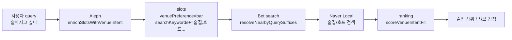

# 구현 참고 노트 (추가 질문 UI · 술집 의도 · 랭킹 · 작동 로그)

이 문서는 2026-06-26 세션에서 수정한 이슈와, 이후 재발 시 확인·수정할 때 참고하는 용도입니다.

**최신 PR**: [feat(swarm): food catalog, ranking weights, activity log, map UX](https://github.com/JaeBaek5/Coding_Marathon/pull/3) (`codex/naver-only-map-fix`)

---

## 진행 사항 요약 (2026-06-26)

| 영역 | 상태 | 요약 |
|------|------|------|
| 음식 마스터 카탈로그 | ✅ | `foodCatalogData.js` **약 160개** · **14카테고리** · intent 버튼 12개 (양식·분식·동남아 포함) |
| Aleph 음식 맞추기 | ✅ | 상태 설명 → LLM 추론 → 추천 3 + 비추천 2~4 (`foodCravingInference.js`) |
| Bet 리뷰·랭킹 | ✅ | 네이버 리뷰 수집 → 규칙 점수 + Bet LLM 적합도 → `rankCandidates` |
| 랭킹 우선순위 | ✅ | **범위 안**: 음식·리뷰 우선 / 거리·시간 후순위 (`timeFit`≤10, `distanceFit`≤5) |
| 음식 가산 | ✅ | `foodPreferenceFit` 최대 **48** (desiredFoods) / **52** (foodPreferenceScores) |
| 작동 로그 UI | ✅ | `ActivityStatusBar` — **기본 접힘**, 0.5초 progress 폴링, 단계·소요시간·메타 표시 |
| 지도 UX | ✅ | 출발·도착·경로 맞춤 뷰포트, 여유시간·도보/차량, 이동 가능 **원** (`travelRange`) |
| 싫어요 재랭킹 | ✅ | `dislikeSimilarity` — 유사 후보 감점·재정렬 |
| 검증 | ⚠️ | `npm run test:unit` **155 passed** · `npm run lint` **12 unused-var 실패** (PR 후속) |

### 랭킹 가산 비중 (대략, 조건 충족 시)

| 묶음 | 최대 점수 | 비율(대략) |
|------|-----------|------------|
| 먹고 싶은 음식 | 48~52 | ~22% |
| 리뷰 (규칙) | ~59 | ~29% |
| 리뷰 (AI) | 45 | ~22% |
| 이동시간 + 거리 | 15 | ~7% |
| 동행·분위기·예산 | 35 | ~17% |

동점 시: 총점 → **음식+리뷰** → 이동시간 → 거리.

---

## 0. 슬롯 파싱 아키텍처 (LLM 우선)

### 원칙

| 계층 | 역할 | 예시 |
|------|------|------|
| **1. Aleph LLM** | 자연어 의미 (음식·술집·해장·분위기) | `venuePreference`, `desiredFoods`, `searchKeywords` |
| **2. 규칙 fallback** | LLM 빈 응답·타임아웃 시만 | `queryFallback.js` |
| **3. 결정론 규칙** | 숫자·단위 (LLM과 병합, LLM 우선) | `30분`, `1만원`, `도보` |
| **4. enrich (최소)** | LLM·fallback도 비었을 때만 | `onlyIfMissing: true` |

### 병합 순서 (`server/src/agents/aleph/slotMerge.js`)

```text
mergeSlotsWithLlmPriority(
  llmSanitized,
  parseDeterministicQueryText(query),
  parseSemanticQueryFallback(query)
)
```

**LLM 값이 항상 이깁니다.** 예전처럼 `parseQueryText`가 semantic 필드를 덮어쓰지 않습니다.

### Aleph 시스템 프롬프트 (`server/src/llm/client.js`)

- `술마시고 싶다` → `venuePreference: bar`
- `어제 술마셔서 해장` → `desiredFoods: ['해장']`, `venuePreference: restaurant`
- **`foodPreferenceScores`**: 음식별 0~100 (0=싫음, 50=중립, 100=강하게 땡김). LLM이 여러 음식의 좋아함/싫어함을 동시에 판단.

### 음식별 점수 (`foodPreferenceScores`)

```json
[
  { "food": "국밥", "score": 95 },
  { "food": "해장", "score": 92 },
  { "food": "치킨", "score": 10 }
]
```

- **Aleph LLM**이 1차로 생성 (스키마 필드)
- **Bet 랭킹**: 가게 이름/카테고리가 고득점 음식과 맞으면 가산, 저득점과 맞으면 감점
- **검색어**: 55점 이상 음식만 Naver 검색 suffix로 사용
- **fallback**: LLM이 점수를 안 주면 `desiredFoods`→85, `excludedFoods`→10, 해장 mismatch→12

### 관련 파일

- `server/src/agents/aleph/slotMerge.js`
- `server/src/agents/aleph/queryFallback.js`
- `server/src/agents/aleph/index.js`

---

## 1. 추가 질문에 선택 버튼이 안 보이는 문제

### 증상

- `추가 질문` 화면에서 일부 항목은 pill 버튼만, 일부는 텍스트 입력만 보임
- `location` 질문은 버튼이 없고 의미 없는 텍스트 입력만 노출됨
- Vite 빌드 오류: `Failed to resolve import .../shared/contracts/questionPresets.js`

### 원인

| 원인 | 설명 |
|------|------|
| 서버 `options` 누락 | LLM follow-up 병합 시 유효 옵션이 2개 미만이면 기본 프리셋 fallback이 불완전했음 |
| 클라이언트 fallback 없음 | `QuestionForm`이 `q.options`가 있을 때만 버튼 렌더 |
| import 경로 오류 | `client/src/lib/components/` 기준 `../../../shared`는 `client/shared`를 가리킴 (한 단계 부족) |
| `location` 필드 | 좌표는 버튼으로 고를 수 없는데 generic text input만 표시 |

### 수정 요약

**공유 프리셋**

- `shared/contracts/questionPresets.js`
  - `QUESTION_LABELS`, `DEFAULT_FIELD_OPTIONS`, `getDefaultOptionsForField()`
  - `schemas.js`(zod)에 의존하지 않음 → 클라이언트에서도 안전하게 import

**서버**

- `server/src/agents/aleph/questionOptions.js`
  - `mergeFollowUpQuestions`: LLM 옵션 부족 시 항상 `getDefaultOptionsForField` fallback
  - `buildDefaultQuestion`: 스키마 기준으로 `desiredFoods` 등 option value 정규화
- `server/src/agents/aleph/index.js`
  - `buildDefaultQuestionsWithSchemas`: field schema 전달

**클라이언트**

- `client/vite.config.js`
  - `@shared` → `../shared` alias
- `client/src/lib/components/QuestionForm.svelte`
  - `resolveOptions(q)`: 서버 options 없으면 `@shared/contracts/questionPresets` fallback
  - `BUTTON_ONLY_FIELDS`: `mealPeriod`, `transportMode`, `desiredFoods` 등은 버튼만
  - `location`: 안내 문구 + 「처음으로 돌아가기」

### 재발 시 확인 체크리스트

1. API 응답 `questions[]`에 `options` 배열이 있는지 (`/api/...` questions status)
2. `FAST_MODE=true`면 LLM 없이 `buildDefaultQuestions`만 사용 → options 있어야 정상
3. `mergeFollowUpQuestions`가 해당 field에 대해 `options.length >= 1` 반환하는지
4. 클라이언트에서 `@shared` alias가 vite.config에 있는지
5. `location`만 버튼 없음은 **의도된 동작** (지도/QueryForm에서 위치 선택)

### 관련 테스트

```bash
npm run test:unit -- server/src/unit/agents/alephQuestionOptions.test.js
```

---

## 2. 「술 마시고 싶다」인데 샤브샤브가 추천되는 문제

### 증상

- 사용자: `술마시고 싶다`, `술 한잔` 등
- 결과: 샤브샤브(샤브로21 등) 같은 일반 식당이 상위 추천

### 원인

| 원인 | 설명 |
|------|------|
| 술 의도 미연결 | `detectBarIntent`/`detectExplicitVenueIntent`가 있었지만 Aleph·Bet·검색에 **연결되지 않음** |
| 기존 키워드 부족 | `parseQueryText`는 `술집`, `맥주` 등만 매칭 → `술마시고` 미매칭 |
| 기본 검색어 | Naver nearby: `맛집`, `한식`, **`일식`**, `중식`, `카페` → 샤브샤브 후보 다수 유입 |
| 랭킹 | `venuePreference: bar`여도 일반 `restaurant` 타입(샤브)은 `isVenueAllowed` 통과 → 감점 없이 상위 가능 |

### 수정 요약

**의도 감지·슬롯 보강** — `server/src/utils/venueGating.js`

- `detectBarIntent()` / `detectCafeIntent()`
  - 패턴: `술\s*마시`, `술\s*한잔`, `음주`, `치맥`, 키워드 `술` 등
- `enrichSlotsWithVenueIntent(slots, textSources)`
  - bar → `venuePreference: 'bar'`, `searchKeywords`에 `술집`, `호프`, `주점` …
- `resolveNearbyQuerySuffixes()`
  - bar일 때: `술집`, `호프`, `주점`, `이자카야`, `포차`, `와인바` ( **`일식` 제외** )
- `scoreVenueIntentFit()`
  - bar 의도 + 술집/호프: **+20점**
  - bar 의도 + 샤브/훠궈/전골 등: **-24점** (`BAR_MISMATCH_PATTERNS`)

**Aleph 파이프라인** — `server/src/agents/aleph/index.js`

- `validateAndProcessSlots` 초반에 `enrichSlotsWithVenueIntent` 호출
- `buildVenueTextSources(slots, userQuery)`로 query·vibe·partyContext 등 통합 분석

**검색** — `server/src/adapters/naverLocalAdapter.js`, `adapters/index.js`

- `venuePreference`를 검색 옵션·캐시 키에 포함
- `server/src/agents/bet/index.js`에서 slots의 `venuePreference` 전달

**랭킹** — `server/src/services/ranking.js`

- `scoreVenueIntentFit` 결과를 `venueIntentFit` / `venueIntentMismatchPenalty`로 `scoreTotal`에 반영

### 데이터 흐름 (술 의도)



### 재발 시 확인 체크리스트

1. **슬롯**: 세션/응답의 `slots.venuePreference === 'bar'` 인지
2. **검색어**: `slots.searchKeywords`에 `술집`, `호프` 포함 여부
3. **Bet 로그**: `bet_search_started` 시점 slots 확인
4. **후보 category**: 샤브샤브가 pool에 들어와도 ranking에서 `venueIntentMismatchPenalty > 0` 인지
5. **오탐**: `술` 단독 키워드는 `술집` 등에도 매칭됨 — 일반 맛집 문맥 오탐 시 `BAR_INTENT_PATTERNS` 조정

### 술 의도가 아닐 때 (기본 동작)

- `venuePreference` 없음 또는 `restaurant`
- nearby 기본: `맛집`, `한식`, `일식`, `중식`, `카페`
- 카페·술집 후보는 `VENUE_MISMATCH_PENALTY`로 restaurant보다 낮게 랭크 (제외는 아님)

### 관련 테스트

```bash
npm run test:unit -- server/src/unit/services/venueGating.test.js
npm run test:unit -- server/src/unit/services/ranking.test.js
npm run test:unit -- server/src/unit/agents/aleph.test.js
```

핵심 케이스:

- `detectBarIntent(['술마시고 싶다'])` → `true`
- `enrichSlotsWithVenueIntent` → `venuePreference: 'bar'`
- bar slot에서 `맥주창고(술집)` > `샤브로21(샤브샤브)` 랭킹

---

## 3. 「술마셔서 해장」인데 치킨집이 추천되는 문제

### 증상

- 사용자: `어제 술마셔서 해장 하고 싶다`
- 결과: 치킨집 등 해장과 맞지 않는 식당 추천

### 원인

| 원인 | 설명 |
|------|------|
| 술집 오탐 | `술마셔`가 bar 패턴(`/술\s*마셔/`)·키워드 `술`에 걸려 **술 마실 의도**로 처리 |
| 해장 의도 없음 | `foodPreference.js`에 해장/국밥 food intent·검색어·랭킹 부재 |
| 기본 검색 | 의도 없으면 `맛집`·`일식` 등 일반 검색 → 치킨·패스트푸드 후보 유입 |
| party 보정 | `친구` 맥락 기본값에 `치킨` 키워드가 contextFit에 포함될 수 있음 |

### 수정 요약

**해장 의도** — `server/src/utils/foodPreference.js`

- `detectHangoverIntent()` / `enrichSlotsWithHangoverIntent()`
  - 패턴: `해장`, `숙취`, `술마셔서`, `어제 술` …
  - `desiredFoods: ['해장']`, `searchKeywords`: 해장국·국밥·순대국 …
  - `venuePreference: 'restaurant'` (술집 검색 차단)
- `FOOD_MISMATCH_KEYWORDS.해장`: 치킨, 후라이드, 피자, 술집 등 **감점**

**술집 오탐 방지** — `server/src/utils/venueGating.js`

- `detectBarIntent`: 해장 맥락이면 `false`
- bar 패턴에서 `술마셔`(과거) 제거 → `술마시고 싶` 등 **미래/의지** 표현만
- `resolveNearbyQuerySuffixes`: `desiredFoods`에 `해장`이면 `HANGOVER_NEARBY_QUERIES` 사용

**Aleph** — `validateAndProcessSlots` 순서

1. `enrichSlotsWithHangoverIntent`
2. `enrichSlotsWithVenueIntent`

### 재발 시 확인

1. `slots.desiredFoods`에 `해장` 포함 여부
2. `slots.venuePreference`가 `bar`가 **아닌지**
3. `searchKeywords`에 `해장국`, `국밥` 포함 여부
4. `술마셔서` vs `술마시고 싶다` 구분 테스트

### 관련 테스트

```bash
npm run test:unit -- server/src/unit/utils/foodPreference.test.js
npm run test:unit -- server/src/unit/agents/aleph.test.js
```

---

## 4. 수정 파일 목록 (빠른 탐색)

| 영역 | 파일 |
|------|------|
| 공유 프리셋 | `shared/contracts/questionPresets.js` |
| **음식 카탈로그** | `shared/contracts/foodCatalog.js`, `shared/contracts/foodCatalogData.js` |
| **음식 맞추기 LLM** | `server/src/agents/aleph/foodCravingInference.js` |
| 질문 options | `server/src/agents/aleph/questionOptions.js`, `followUpQuestions.js` |
| 슬롯·의도 | `server/src/agents/aleph/index.js`, `server/src/utils/venueGating.js`, `foodPreference.js` |
| **리뷰 점수** | `server/src/services/reviewScoring.js`, `llmReviewScoring.js`, `candidateEnrichment.js` |
| **작동 로그** | `server/src/services/sessionProgress.js`, `progressFormat.js`, `client/.../ActivityStatusBar.svelte` |
| 검색 | `server/src/adapters/naverLocalAdapter.js`, `server/src/adapters/index.js` |
| 랭킹 | `server/src/services/ranking.js` |
| Bet / Gimel / Orchestrator | `server/src/agents/bet/index.js`, `gimel/index.js`, `orchestrator/index.js` |
| **지도·이동 범위** | `client/src/lib/components/MapPlaceholder.svelte`, `client/src/lib/utils/travelRange.js` |
| UI | `client/src/lib/components/QuestionForm.svelte`, `QueryForm.svelte`, `client/vite.config.js` |

---

## 5. 앞으로 수정할 때 권장 원칙

1. **프리셋 단일 출처**: 질문 버튼 label/value는 `shared/contracts/questionPresets.js`만 수정하고, 서버 `questionOptions.js`는 여기서 re-export/import.
2. **의도는 텍스트 소스 통합**: bar/cafe 판별 시 `userQuery`만 보지 말고 `buildVenueTextSources`와 동일한 소스 집합 사용.
3. **검색·랭킹 쌍으로**: `venuePreference`를 바꿀 때 `resolveNearbyQuerySuffixes`와 `scoreVenueIntentFit`을 함께 검토.
4. **클라이언트 shared import**: 반드시 `@shared/...` alias 사용 (`../../../../shared` 수동 경로 지양).
5. **테스트 추가**: 새 의도 표현(예: `소주 한잔`) 추가 시 `venueGating.test.js` + 필요 시 `aleph.test.js`에 케이스 추가.

6. **과거/미래 술 표현 분리**: `술마셔서`(해장)와 `술마시고 싶다`(bar)는 다른 intent — 패턴 추가 시 둘 다 테스트.

---

## 6. 수동 검증 (로컬)

1. `npm run dev` — vite.config 변경 후 dev 서버 재시작
2. Query: `친구랑 술마시고 싶다` → 술집/호프 계열
3. Query: `어제 술마셔서 해장 하고 싶다` → 국밥·해장국 계열 (치킨 X)
4. Query: `고기 먹고 싶다` → 가까운 치킨보다 고깃집·리뷰 매칭 우선 (범위 내)
5. 슬롯 부족 시 추가 질문 → pill 버튼 노출 확인
6. 추천 요청 중 하단 **작동 로그** 바 → 탭하여 단계 펼침 확인
7. 지도: 여유 시간·도보/차량 변경 시 원 반경 변화 확인
8. unit: `npm run test:unit` (155 tests)

---

## 7. 음식 카탈로그 · 랭킹 · 작동 로그 (2026-06-26)

### 7.1 음식 마스터 카탈로그

- **단일 출처**: `shared/contracts/foodCatalogData.js` (데이터) + `foodCatalog.js` (조회 API)
- **규모**: 약 **160** 메뉴/의도, **14** 카테고리 (`southeast_asian` 포함)
- **용도**: `desiredFoods`, 검색어 확장, 랭킹 키워드, Aleph 질문 버튼, 음식 맞추기 LLM 검증
- **intent 버튼 12개**: 해장, 고기, 한식, 일식, 중식, 면, 치킨, 해산물, 찌개, 양식, 분식, 동남아

### 7.2 Aleph 음식 맞추기

- `foodCravingInference.js`: 사용자 **상태만** 있어도 LLM이 추천 음식 3 + 비추천 2~4 추론
- `QuestionForm`: 비추천 태그 표시, 음식 선택 전 제출 비활성화
- Aleph 기본 모델: `anthropic/claude-sonnet-4.6` (설정은 `server/src/llm/config.js`)

### 7.3 Bet → 랭킹 파이프라인

```text
Naver 검색 → 경로 계산 → 리뷰 수집(enrich) → LLM 리뷰 적합도(선택) → rankCandidates → Gimel 이유
```

- **리뷰 규칙 점수** (`reviewScoring.js`): 평점·긍정/부정 키워드·원하는 음식 키워드·리뷰 개수
- **리뷰 AI** (`llmReviewScoring.js`): relevance 0~100 → 최대 30점, sentiment → 최대 15점
- **음식 가산** (`foodPreference.js`): 이름/카테고리 키워드 매칭, mismatch 감점

### 7.4 랭킹 우선순위 (사용자 요청 반영)

**원칙**: 이동 **범위 안**이면 거리보다 **먹고 싶은 음식 + 리뷰**가 순위를 가른다.

| 항목 | 최대 | 역할 |
|------|------|------|
| `foodPreferenceFit` | 48~52 | 1순위 축 |
| `reviewFit` + LLM | ~104 | 1순위 축 |
| `timeFit` | 10 | 범위 내 동점 처리 (범위 밖 → 0) |
| `distanceFit` | 5 | 최후순위 가산 |

구현: `server/src/services/ranking.js` — `RANKING_WEIGHTS`, `computeTimeFit`, `computeDistanceFit`, 정렬 시 `foodReviewSortScore` 우선.

### 7.5 작동 로그 (Activity Log)

| 계층 | 설명 |
|------|------|
| 서버 | `setSessionProgress` — Orchestrator / Bet / Gimel 단계를 `session.progressLog`에 기록 |
| API | `GET /api/sessions/:id/progress` |
| 클라이언트 | `session.svelte.js` 500ms 폴링 → `ActivityStatusBar` |
| UI | **기본 접힘**; 펼치면 phase 라벨, 시각, +소요시간, detail, meta |

### 7.6 지도

- `MapPlaceholder.svelte`: 출발·도착·경로 기준 `fitBounds`
- 좌상단 **여유 시간(분)** + **도보/차량** → `travelRange.js`로 이동 가능 원 반경 표시

### 재발 시 확인

```bash
npm run test:unit -- server/src/unit/contracts/foodCatalog.test.js
npm run test:unit -- server/src/unit/services/ranking.test.js
npm run test:unit -- server/src/unit/services/reviewScoring.test.js
npm run test:unit -- server/src/unit/agents/foodCravingInference.test.js
npm run test:unit -- server/src/unit/services/sessionProgress.test.js
```

---

*마지막 갱신: 2026-06-26 — PR #3 (`codex/naver-only-map-fix`)*
